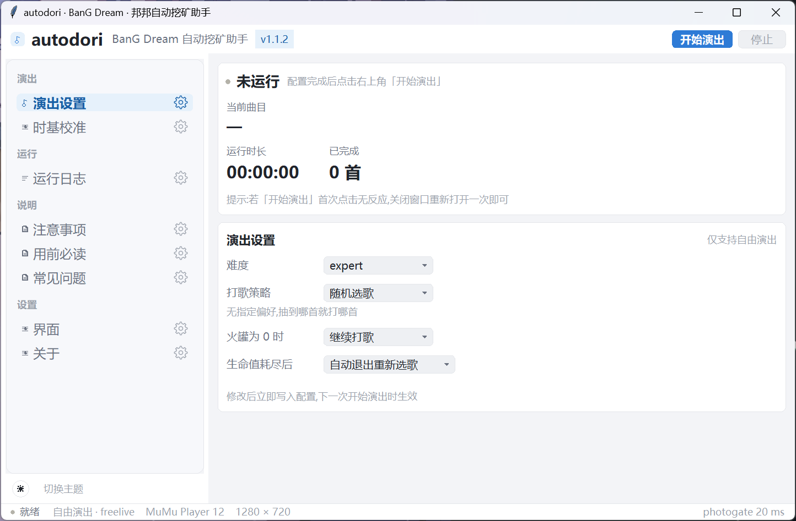
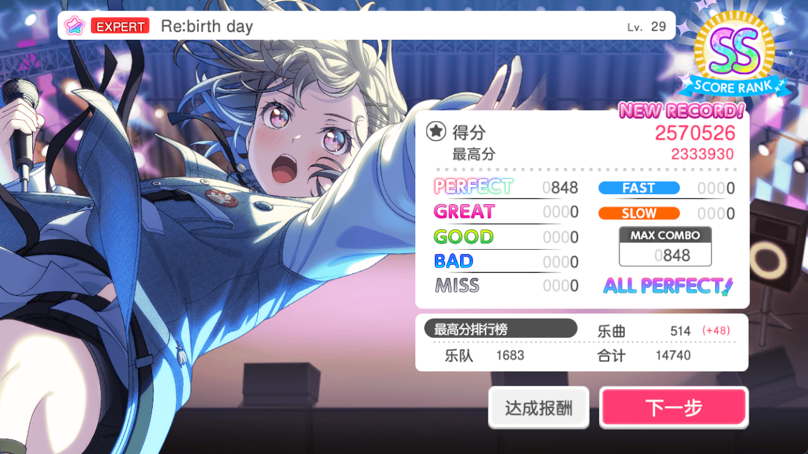
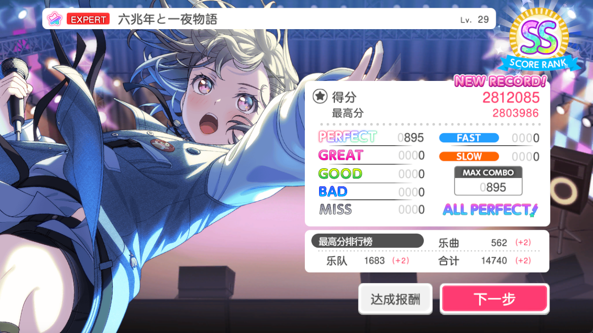

<div align="center">

# BanG Dream · 邦邦自动挖矿助手

邦多利(BanG Dream! 国服)自动打歌脚本 + GUI 启动器

    

> 关键词:邦邦 / BanG Dream / 邦多利 / 国服 / 自动打歌 / 自动挖矿 / 脚本 / 模拟器 / MuMu / autodori

</div>

## ✨ 功能

- **更现代化的图形界面**(Maa/SukiUI 风格,自绘控件):左栏导航、卡片式设置、常驻运行状态与当前曲目、亮/暗主题、字体缩放
- **支持多种选歌策略**:**挖矿为主**(优先没打过 / 没全连的歌)**随机选歌**(抽到什么打什么)
- **GUI 启动器**(无需命令行):选难度 / 打歌策略 / 火罐策略 / photogate / 生命值耗尽策略
- **photogate 自动校准**:结算后按 FAST/SLOW 分布自动微调打歌时基,几首歌内收敛,不同电脑无需手动调参
- 自动选歌、打歌、结算后再演连打;自动处理 PT 奖励弹窗、角色对话、演出失败、活动故事等结算流程
- 生命值耗尽后可选择**自动退出重新选歌**或**等待手动操作**;火罐为 0 时可选择**继续打歌**或**退出游戏**
- 模拟器兼容:Mumu 12 / MumuV5 / 雷电(推荐 MuMu)

## 📸 界面与打歌成果

**GUI 主界面**(左栏导航 + 运行状态卡片 + 卡片式设置 + 亮/暗主题):



**战绩可查!👇**






## 📌 致谢与来源说明

本项目基于 **GPLv3** 许可证的 [EvATive7/autodori](https://github.com/EvATive7/autodori) 修改而来,感谢原作者的辛勤付出与开源精神。

**本版本在原版基础上新增/修改了:**
- 全新 **Maa/SukiUI 风格图形界面**(自绘控件、左栏导航、亮/暗主题、常驻运行状态与当前曲目)
- 支持 **FULL** 歌曲
- 支持多种选歌策略: **挖矿为主 / 随机选歌**
- 新增结算弹窗处理(PT 奖励、角色对话、演出失败、活动故事)
- 新增生命值耗尽策略(自动退出重新选歌 / 等待手动)、火罐为 0 策略
- 修复若干弹窗/模板问题,补充日志过滤与 GUI 偏好设置

**依据 GPLv3,本仓库的修改与分发需遵守:**
- 保留 GPLv3 许可证(见 [LICENSE](LICENSE))
- 注明原作者与来源(本说明即为此目的)
- 修改部分开源共享、禁止商业化
- 本项目为 fork 修改版,与原版项目相互独立,请优先阅读本仓库的 README

## 🛠 环境要求(重要,否则无法正常打歌)

### 模拟器设置
- 使用 MuMu Player 12,分辨率 **1280x720**,Vulkan 渲染
- **保持高帧率,不要限制 30fps**(会破坏打歌同步)
- **取消勾选「禁用安卓系统声音」**(MuMu 设置 → 设备 → 声音)——若勾选会导致整个打歌时基按早、狂爆 FAST(FAST 偏移最常见的原因),关闭后即完全正常
- 打歌期间尽量不要操作电脑,避免性能波动

### 游戏设置
- 选曲列表设为**"正常"**,清空歌曲筛选器
- 演出设定:将流速调整为 **8.0**
- 演出效果·音量设定:关闭 **"3D切入模式"**,将**"动作模式"**改为**"轻量模式"**
- 演出效果·音量设定:启用 **"FAST/SLOW表示"** 和 **"Perfect状态显示"**
- 演出模式仅支持**自由演出(freelive)**,不支持协力模式

## 🚀 使用方法

### 方式一:独立版(不需要 Python,推荐给普通用户)

1. 从 [Release](https://github.com/1979711854/bangdream-autodori/releases) 下载 `bangdream-autodori_win64.zip`
2. 解压到任意文件夹
3. 双击 **`autodori_gui.exe`**
4. 主界面选难度等参数,点 **开始打歌**

> 独立版已内置 bot 运行环境(autodori.exe + assets),解压即用;首次运行会在同目录生成 `data/`、`debug/` 文件夹。压缩包里的 exe 未被 .gitignore 影响,直接可分发。

### 方式二:源码运行(适合开发者/自行调参)

```bash
git clone https://github.com/1979711854/bangdream-autodori
cd bangdream-autodori
python -m venv .venv
.venv\Scripts\activate
pip install -r requirements.txt
python build.py          # 自动整理/下载依赖
python gui.py            # 启动 GUI
# 或命令行直接跑:
python src/autodori.py --mode main --difficulty expert --livemode freelive
```

> 打包 GUI 为 exe:`pyinstaller --onefile --windowed --name autodori_gui gui.py`

## 🖥 GUI 说明(Maa/SukiUI 风格)

- 顶部**应用栏**:难度快捷分段、版本号、亮/暗主题切换、字号
- **常驻运行卡片**:状态指示、**当前曲目**、运行时长、已完成首数、开始/停止演出按钮
- **左栏导航**:演出设置(难度 / 打歌策略 / 火罐 / 生命耗尽)、时基校准(photogate ± 自动校准)、运行日志、注意事项 / 用前必读 / 常见问题、界面设置 / 关于
- **运行日志**:只显示关键事件,可打开日志目录 / 导出完整日志 / 清空
- 设置持久化在 `data/gui_config.json`(主题 / 字号 / 窗口 / 当前页等)

## ❓ 常见问题

**Q:打歌总是 FAST(狂爆 FAST / 整体按早),怎么办?**
A:先检查 MuMu 模拟器「设置 → 设备 → 声音」里的「禁用安卓系统声音」是否被勾选——若勾选请取消(允许系统声音),这是 FAST 偏移最常见的原因,关闭后即完全正常;若还不行,再开「自动校准 photogate」。

**Q:为什么无法正常打歌?**
A:请查看「注意事项」和 README.md,检查游戏和模拟器设置是否正确。

**Q:为什么有些歌会爆很多 GREAT 和 MISS?**
A:个别歌曲难度较大,机器识别可能存在一定延迟;
模拟器长时间运行后发热/内存占用上升,触控输入延迟波动变大,精度下降。
建议:偶尔重启模拟器、保证电脑不过热、保持高帧率。

若几乎每首 GREAT 都偏多(而非个别难歌),通常是 photogate(打歌时基)没对准:
打开主界面「自动校准 photogate」正常打几首歌即可自动收敛;
也可手动调:GREAT 偏 SLOW 减小、偏 FAST 增大,每次约 10ms,范围建议 0~150ms。

**Q:使用脚本有封号的风险吗?**
A:存在封号的可能性,但只要不用于冲榜,封号的概率就不大。
注:作者仅提供脚本,请自行评估风险,不为封号等行为负责。

**Q:我发现了 BUG?**
A:可以反馈到 GitHub Issues。

**Q:如何指定打某一首歌?**
A:代码本身暂不支持直接指定某首歌,但先手动切换到「收藏」列表,
把想打的歌加入游戏内的「收藏」列表,让脚本只从收藏里选歌。

## ⚠️ 注意

1. 推荐使用最新版 MuMu 模拟器;雷电模拟器测试较少,且存在性能问题。
2. 本项目尚不完善,可能发生错误,欢迎 Issue 和 PR。

## 📝 风险、使用限制、免责声明、许可证和版权

本项目的初衷仅是作为小助手,方便各位玩家更轻松地体验游戏和养成的乐趣,禁止利用本项目从事破坏游戏公平的行为。请大家爱护邦邦游戏环境,遵守游戏规则。

请务必知悉,本项目**不能用于冲榜**。官方总是对冲榜用户进行二次检测,在模拟器环境上运行、非常规输入方式等都是高风险因素,将本项目用于冲榜几乎必然触发封号。

本项目以开源且免费的形式发布,禁止任何个人或组织以商业化方式使用或传播。

因使用或无法使用本项目所导致的任何直接或间接损失,本项目及开发者均不承担责任。用户在使用过程中应自行评估并承担全部风险。

本项目在 **GPLv3** 许可下开放源代码,修改、复制、分发请遵守[项目许可证](LICENSE)。本项目是 [EvATive7/autodori](https://github.com/EvATive7/autodori) 的 fork,再分发时需保留原作者署名与来源说明(见上方「致谢与来源说明」),并保持 GPLv3 许可。

本项目还直接引用、修改或分发了以下开源代码、组件或二进制:
- [minitouch ver.EvATive7](https://github.com/EvATive7/minitouch)(Apache License 2.0)
- [MaaFramework](https://github.com/MaaXYZ/MaaFramework)(LGPLv3)
